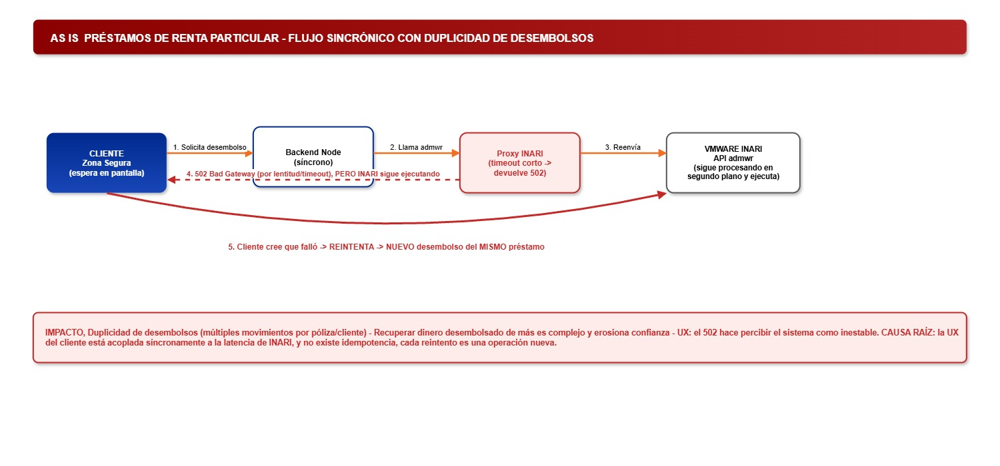
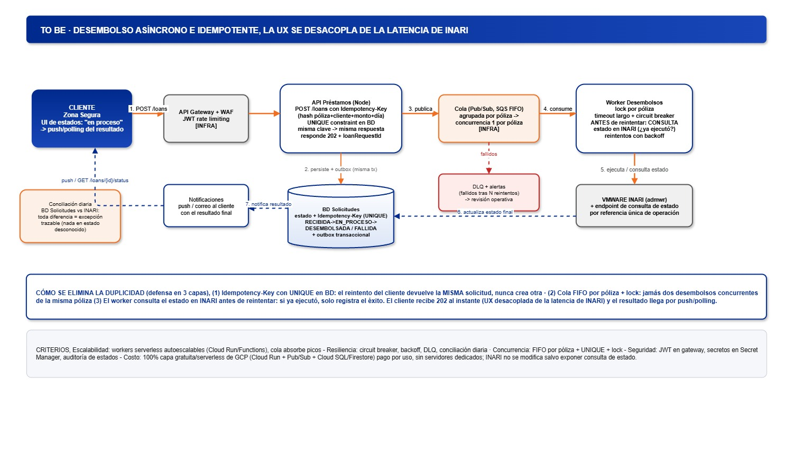

# Reto técnico Interseguro - Technical Lead

Solución de los tres ejercicios del enunciado, organizada como monorepo.
Cada proyecto es autocontenido (código, pruebas, Dockerfile, contrato OpenAPI y README propio);
este documento sirve de índice, guía de ejecución local y de despliegue, y matriz de cumplimiento.

**En producción:** [frontend](https://reto-tecnico-interseguro.vercel.app) (Vercel) ·
[endorse-service](https://endorse-service.onrender.com/v1/health) y
[routes-service](https://routes-service-68hr.onrender.com/v1/health) (Render). Ver [Despliegue](#despliegue).

Enunciado provisto por Talsory/Interseguro - no se versiona por tratarse de material del proceso; disponible a solicitud.

## Contenido

| Carpeta | Ejercicio | Tecnología | Descripción |
|---|---|---|---|
| [endorse-service/](endorse-service/) | Ejercicio 1 - Parte 1 | Node 22, TypeScript, Hapi, TypeORM | Traductor de endosos: JSON plano → JSON del core según plantillas dinámicas en BD |
| [routes-service/](routes-service/) | Ejercicio 2 - Parte 1 | Go 1.23 (biblioteca estándar) | Rutas óptimas: Dijkstra multi-base para asignar la grúa más cercana |
| [evolution-frontend/](evolution-frontend/) | Ejercicios 1 y 2 - Parte 2 | Vue 3, Vite | Un solo frontend con dos pestañas, como permite el enunciado |
| [ej3-arquitectura/](ej3-arquitectura/) | Ejercicio 3 | draw.io | Arquitectura AS IS / TO BE de préstamos de renta particular |

## Ejercicio 1 - Servicio traductor de endosos

API versionada (`POST /v1/endorse/translate`) que consulta en BD la plantilla activa por producto y tipo de
endoso, y construye el JSON del core respetando el orden de `dynamicData`, los eventos y los valores por
defecto. Un producto o tipo de endoso nuevo se incorpora solo con `INSERT`s. Detalle, modelo ER y reglas de
traducción en el [README de endorse-service](endorse-service/README.md).

## Ejercicio 2 - Servicio de rutas óptimas

API versionada (`POST /v1/routes/optimal`) que calcula, con una única ejecución de Dijkstra desde un nodo
origen virtual, la ruta más corta entre la base de grúas más cercana y el distrito del siniestro. El grafo
llega en cada petición, por lo que puede cambiar sin modificar la lógica. Detalle en el
[README de routes-service](routes-service/README.md).

## Ejercicio 3 - Arquitectura de préstamos de renta particular

Fuente editable: [INTERSEGURO_reto.drawio](ej3-arquitectura/INTERSEGURO_reto.drawio) (dos páginas: AS IS y TO BE).

### AS IS - Problema actual



### TO BE - Arquitectura propuesta



### Resumen de la solución

1. **Idempotencia:** el cliente envía un `Idempotency-Key` (hash de póliza, cliente, monto y día) y la BD lo protege con una restricción `UNIQUE`; un reintento devuelve la misma solicitud y nunca crea otra.
2. **Desacople de la experiencia:** la API responde `202` con un identificador de solicitud al instante, y el resultado llega por push o polling; la latencia de INARI deja de bloquear al cliente.
3. **Control de concurrencia:** una cola FIFO agrupada por póliza (Pub/Sub con ordering key o SQS FIFO), más un lock en el worker, garantiza un solo desembolso en curso por póliza.
4. **Reintentos seguros:** antes de reintentar, el worker consulta el estado de la operación en INARI; si ya se ejecutó, solo registra el éxito.
5. **Fallos y control:** los mensajes que agotan sus reintentos pasan a una DLQ con alertas para revisión operativa, y una conciliación diaria contrasta la BD de solicitudes con INARI, de modo que ninguna operación queda en estado desconocido.

## Ejecución local

### Requisitos

- Node 22 o superior (≥ 22.13) y npm
- Go 1.23 o superior
- Para el E2E: Chromium de Playwright (`npx playwright install chromium`)

### Puertos

| Proceso | Puerto | Nota |
|---|---|---|
| endorse-service | 3001 | Su default es 8080; en local se fija `PORT=3001`, que es la URL por defecto del frontend |
| routes-service | 8080 | Default del servicio y del frontend |
| evolution-frontend | 5173 | `npm run dev` (Vite) |

### Orden de arranque

Los dos servicios **no arrancan sin secretos** (`JWT_SECRET`, `CLIENT_ID`, `CLIENT_SECRET`). Los valores
siguientes son solo de ejemplo para desarrollo local.

**1. endorse-service** (terminal 1):

```bash
cd endorse-service
npm install
npm run seed      # migraciones + plantillas de ejemplo en data/endorse.sqlite
PORT=3001 JWT_SECRET=dev-endorse-jwt CLIENT_ID=frontend CLIENT_SECRET=dev-endorse-secret \
  CORS_ORIGIN=http://localhost:5173 npm run dev
```

**2. routes-service** (terminal 2):

```bash
cd routes-service
JWT_SECRET=dev-routes-jwt CLIENT_ID=frontend CLIENT_SECRET=dev-routes-secret \
  CORS_ORIGIN=http://localhost:5173 go run .
```

**3. evolution-frontend** (terminal 3): crear `evolution-frontend/.env` a partir de `.env.example`, con las
credenciales de cada servicio:

```dotenv
VITE_ENDORSE_API_URL=http://localhost:3001
VITE_ROUTES_API_URL=http://localhost:8080
VITE_ENDORSE_CLIENT_ID=frontend
VITE_ENDORSE_CLIENT_SECRET=dev-endorse-secret
VITE_ROUTES_CLIENT_ID=frontend
VITE_ROUTES_CLIENT_SECRET=dev-routes-secret
```

```bash
cd evolution-frontend
npm install
npm run dev       # http://localhost:5173
```

En PowerShell, las variables de entorno se definen con `$env:NOMBRE = "valor"` antes de cada comando.
El trade-off de tener credenciales en el frontend está documentado en el
[README de evolution-frontend](evolution-frontend/README.md#trade-off-de-seguridad).

## Pruebas

| Proyecto | Comando | Pruebas |
|---|---|---|
| routes-service | `go vet ./... && go test ./...` | 27 (algoritmo, API, auth y configuración) |
| endorse-service | `npm test` | 24 (mapper, servicio, API, esquema de BD y configuración) |
| endorse-service | `npx tsc --noEmit` · `npm run lint:openapi` | Tipos y contrato OpenAPI (Redocly) |
| evolution-frontend | `npm test` · `npm run build` | 10 (cliente API y ejemplo precargado) + build de producción |

Los dos contratos OpenAPI se validan con Redocly: en endorse-service con `npm run lint:openapi`; en
routes-service con `npx --prefix ../endorse-service redocly lint openapi.yaml`.

### Prueba de integración (E2E)

Levanta los tres procesos reales desde sus carpetas y recorre las dos pestañas en Chromium headless (12 escenarios):

```bash
cd evolution-frontend
npx playwright install chromium   # solo la primera vez
npm run e2e
```

Por defecto, routes-service se levanta en el puerto **8081** durante esta prueba, para no chocar con otro
proceso en el 8080; se cambia con `E2E_ROUTES_PORT=8080 npm run e2e`. Requiere Go en el `PATH`.

La misma suite corre contra producción (Vercel + Render) sin levantar procesos locales, con timeouts de 90 s
por el arranque en frío:

```bash
curl -s https://endorse-service.onrender.com/v1/health      # calentamiento
curl -s https://routes-service-68hr.onrender.com/v1/health
cd evolution-frontend && npm run e2e:prod
```

## Despliegue

| Componente | URL | Plataforma |
|---|---|---|
| evolution-frontend | https://reto-tecnico-interseguro.vercel.app | Vercel |
| endorse-service | https://endorse-service.onrender.com | Render |
| routes-service | https://routes-service-68hr.onrender.com | Render |

### Backends en Render

Cada servicio es un *Web Service* independiente en Render, con la misma configuración:

| Parámetro | endorse-service | routes-service |
|---|---|---|
| Plan | Free | Free |
| Runtime | Docker (su propio `Dockerfile`) | Docker (su propio `Dockerfile`) |
| Root Directory | `endorse-service` | `routes-service` |
| Health check path | `/v1/health` | `/v1/health` |
| Variables (panel de Render) | `JWT_SECRET`, `CLIENT_ID`, `CLIENT_SECRET`, `CORS_ORIGIN` | `JWT_SECRET`, `CLIENT_ID`, `CLIENT_SECRET`, `CORS_ORIGIN` |
| Auto-deploy | On commit (rama `main`) | On commit (rama `main`) |

- `CORS_ORIGIN` es `https://reto-tecnico-interseguro.vercel.app` en ambos: solo el frontend publicado puede
  llamarlos desde el navegador.
- `PORT` no se define: Render lo inyecta y los dos servicios lo leen.
- endorse-service ejecuta migraciones y seed durante el build de la imagen, así que la base SQLite de demo
  viaja dentro de ella; cada despliegue parte de los mismos datos de ejemplo.

### Frontend en Vercel

- Root Directory: `evolution-frontend`, framework preset **Vite** (build `npm run build`, salida `dist`).
- Variables de entorno del proyecto: `VITE_ENDORSE_API_URL`, `VITE_ROUTES_API_URL`,
  `VITE_ENDORSE_CLIENT_ID`, `VITE_ENDORSE_CLIENT_SECRET`, `VITE_ROUTES_CLIENT_ID`,
  `VITE_ROUTES_CLIENT_SECRET`. Las dos URLs apuntan a los servicios de Render y cada par de credenciales
  coincide con `CLIENT_ID`/`CLIENT_SECRET` del servicio correspondiente.
- Vite embebe las `VITE_*` en el bundle durante el build: cambiar una exige redesplegar el frontend
  (trade-off documentado en el [README de evolution-frontend](evolution-frontend/README.md#trade-off-de-seguridad)).

### Gestión de secretos

- Los secretos se generan por entorno (local, E2E, producción) y **nunca se versionan**: los de producción
  viven solo en los paneles de Render y Vercel.
- Los `.env.example` solo documentan las claves; sus valores son marcadores.
- Los servicios no arrancan si falta `JWT_SECRET`, `CLIENT_ID` o `CLIENT_SECRET` (fail-fast, sin defaults).

### Arranque en frío

El plan Free de Render suspende los servicios tras un periodo de inactividad: **la primera petición tras
inactividad puede tardar ~30-60 s** mientras el contenedor se reactiva; las siguientes responden con
normalidad. Para una demo conviene abrir antes cada `/v1/health`.

## Matriz de cumplimiento

Estado: ✅ cumplido y verificado · 🟡 parcial · ❌ pendiente.

### Ejercicio 1 - Servicio traductor de endosos

| Requisito del enunciado | Estado | Evidencia |
|---|---|---|
| Endpoint `/endorse/translate` | ✅ | [routes/index.ts](endorse-service/src/routes/index.ts) (`POST /v1/endorse/translate`) |
| Recibir un JSON plano | ✅ | [endorse-request.dto.ts](endorse-service/src/entities/endorse-request.dto.ts) (esquema Joi) |
| Consultar en BD orden y etiquetas de `dynamicData` | ✅ | [plantilla-campo.model.ts](endorse-service/src/models/plantilla-campo.model.ts), [plantilla.repository.ts](endorse-service/src/repositories/plantilla.repository.ts) |
| Consultar en BD lista y orden de `eventAppliedEntities` | ✅ | [plantilla-evento.model.ts](endorse-service/src/models/plantilla-evento.model.ts) |
| Consultar en BD valores por defecto | ✅ | `valor_default` en [endorse.mapper.ts](endorse-service/src/mappers/endorse.mapper.ts) |
| Construir el JSON respetando orden y defaults | ✅ | Test "produce exactamente la salida del PDF" en [endorse.mapper.test.ts](endorse-service/tests/endorse.mapper.test.ts) |
| Devolver el JSON listo para el core | ✅ | Test de API y E2E: respuesta idéntica al ejemplo del enunciado |
| Estructura en capas (solo las necesarias) | ✅ | `src/{routes,controllers,services,entities,mappers,repositories,models}`; omisión de Integration y Publisher justificada en su README |
| Parte 2 - Frontend | ✅ | [EndorseTab.vue](evolution-frontend/src/components/EndorseTab.vue); 7 escenarios E2E |
| Criterio: modelado de BD (y diagrama ER) | ✅ | [Modelo ER](endorse-service/docs/er-plantillas.png), [migración](endorse-service/src/database/migrations/1727100000000-InitialSchema.ts), [schema.test.ts](endorse-service/tests/schema.test.ts) |
| Criterio: transformación de datos | ✅ | Ídem "Construir el JSON" |
| Criterio: extensibilidad sin tocar código | ✅ | Segunda plantilla en [seed-data.ts](endorse-service/src/database/seed-data.ts); test y E2E "extensibilidad" |
| Criterio: validaciones de campos faltantes | ✅ | 422 `MISSING_FIELDS` con la lista completa ([endorse.controller.ts](endorse-service/src/controllers/endorse.controller.ts)) |
| Criterio: versionamiento del API | ✅ | Prefijo `/v1` |
| Criterio: pruebas unitarias | ✅ | 24 pruebas en verde |
| Criterio: mantenibilidad / SOLID | ✅ | Interfaz `PlantillaRepository`, composition root en [server.ts](endorse-service/src/server.ts) |
| Criterio: despliegue - Dockerizar | ✅ | [Dockerfile](endorse-service/Dockerfile) multi-stage `node:22-alpine`; Render construye y ejecuta la imagen (runtime Docker) |
| Criterio: despliegue - nube con capa gratuita | ✅ | Render plan Free: https://endorse-service.onrender.com, consumido por https://reto-tecnico-interseguro.vercel.app (Vercel); ver [Despliegue](#despliegue) |
| Criterio: seguridad del servicio (JWT) | ✅ | JWT HS256 en [auth.service.ts](endorse-service/src/services/auth.service.ts); arranque bloqueado sin secretos |

### Ejercicio 2 - Servicio de rutas óptimas

| Requisito del enunciado | Estado | Evidencia |
|---|---|---|
| Implementar Dijkstra en Go | ✅ | [dijkstra.go](routes-service/internal/graph/dijkstra.go) |
| Múltiples bases; devolver siempre la más cercana | ✅ | `OptimalRoute`: un único Dijkstra con origen virtual |
| Grafo flexible (distritos = nodos, distancias = pesos) | ✅ | Tipo `Graph` recibido en cada petición |
| Error controlado si el accidente es inalcanzable | ✅ | 422 `UNREACHABLE` ([controller.go](routes-service/internal/api/controller.go)) |
| Salida igual al ejemplo del enunciado | ✅ | `TestOptimal_OK` y E2E |
| Parte 2 - Frontend | ✅ | [RoutesTab.vue](evolution-frontend/src/components/RoutesTab.vue); 5 escenarios E2E |
| Criterio: implementación eficiente del camino mínimo | ✅ | Una sola ejecución de Dijkstra, O(E log V), en lugar de una por base |
| Criterio: claridad del API | ✅ | [openapi.yaml](routes-service/openapi.yaml) validado con Redocly |
| Criterio: extensibilidad del grafo | ✅ | El grafo viaja en el request |
| Criterio: versionamiento del API | ✅ | Prefijo `/v1` |
| Criterio: pruebas unitarias del algoritmo | ✅ | 27 pruebas en verde, 12 del algoritmo |
| Criterio: mantenibilidad / SOLID | ✅ | Interfaz `RouteService` inyectada en `NewMux` |
| Criterio: despliegue - Dockerizar | ✅ | [Dockerfile](routes-service/Dockerfile) `golang:1.23-alpine` + distroless; Render construye y ejecuta la imagen (runtime Docker) |
| Criterio: despliegue - nube con capa gratuita | ✅ | Render plan Free: https://routes-service-68hr.onrender.com, consumido por https://reto-tecnico-interseguro.vercel.app (Vercel); ver [Despliegue](#despliegue) |
| Criterio: seguridad del servicio (JWT) | ✅ | JWT HS256; sin secretos por defecto, credenciales comparadas en tiempo constante, timeouts y límite de 1 MB |

### Ejercicio 3 - Arquitectura de préstamos de renta particular

| Criterio del enunciado | Estado | Evidencia en el [diagrama TO BE](ej3-arquitectura/to-be.jpg) |
|---|---|---|
| Diagrama en draw.io (AS IS y TO BE) | ✅ | [INTERSEGURO_reto.drawio](ej3-arquitectura/INTERSEGURO_reto.drawio), dos páginas |
| Escalabilidad de la arquitectura | ✅ | Workers serverless autoescalables (Cloud Run/Functions) y una cola que absorbe los picos entre la API y INARI |
| Resiliencia y reintentos | ✅ | Circuit breaker y backoff en el worker, consulta de estado en INARI antes de reintentar, DLQ con alertas y conciliación diaria |
| Control de concurrencia | ✅ | `Idempotency-Key` con `UNIQUE` en BD, cola FIFO agrupada por póliza y lock por póliza en el worker |
| Seguridad | ✅ | API Gateway con WAF, JWT y rate limiting; secretos en Secret Manager; auditoría de estados en la BD de solicitudes |
| Costo de implementación | ✅ | Servicios serverless con capa gratuita de GCP (Cloud Run, Pub/Sub, Cloud SQL/Firestore), pago por uso y sin servidores dedicados; INARI solo expone una consulta de estado |

Última actualización: 23-09-2026.
